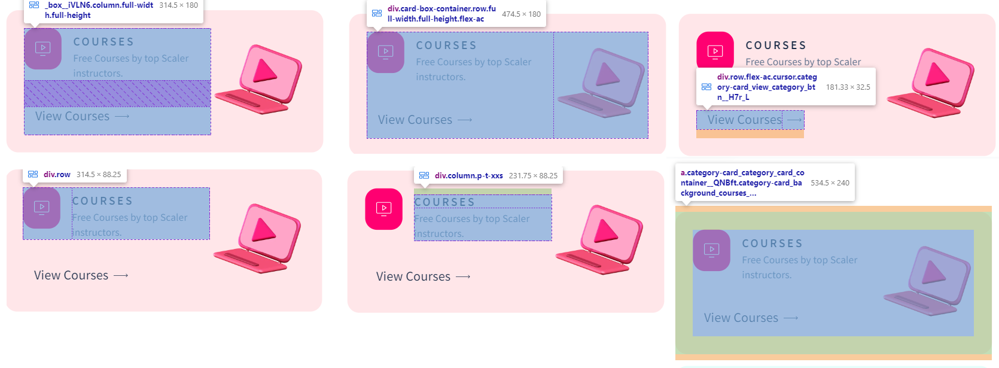
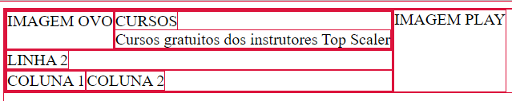
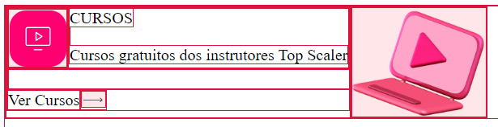
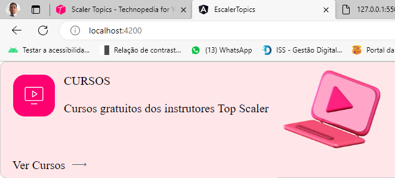
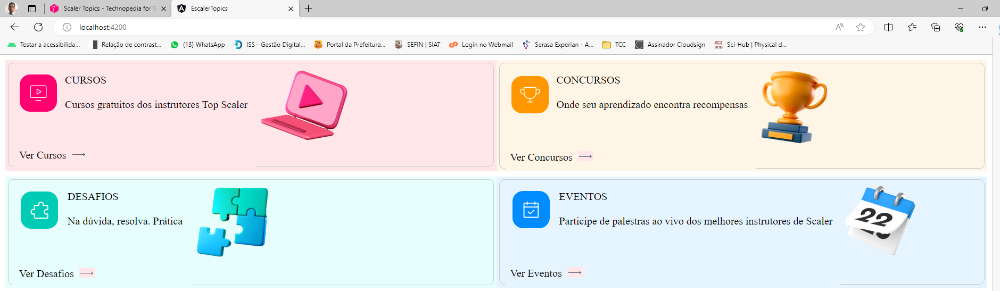
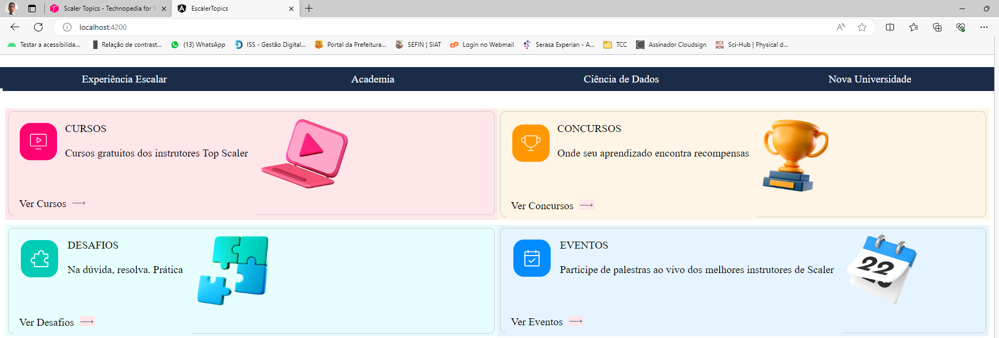
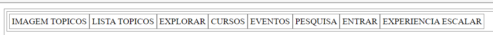
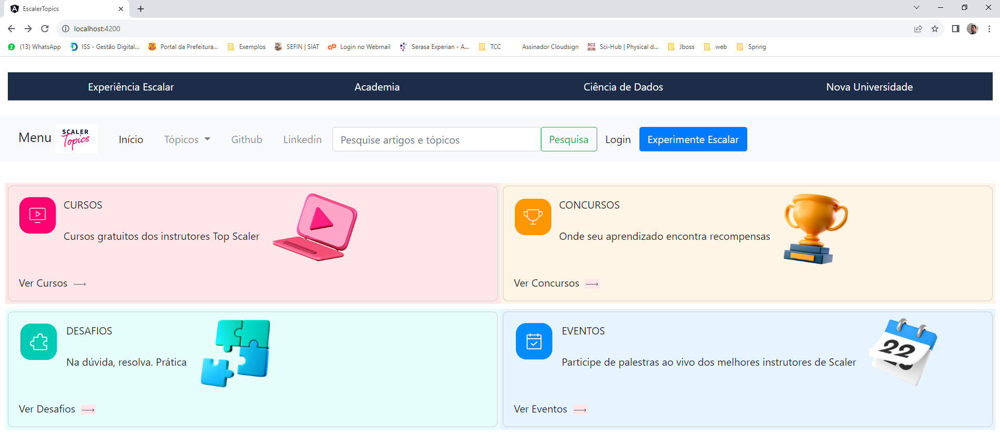

## Projeto baseado no site apenas para efeito de estudos e contribuição para a comunidade.

https://www.scaler.com/topics/

**Componentes identificados inicialmente**

### Componente Header
- Componente Menu Title 
- Componente Menu Bar 

### Componente Content
  - Componente List Card
     - 

     - Identificando Partes do HTML

       -

     - Componente Card 
        - Card Cursos
          - Desenho técnico 
          - 
          - Aplicação do Html
          - 
          - Rodando como componente reutilizavel
          -         
        - Card Desafios
          - Similar ao Primeiro
        - Card Concursos
          - Similar ao Primeiro
        - Card Eventos
          - Similar ao Primeiro
  -         

### Component Footer

***Design dos componentes HTML***

- Menu Title
  -

- Adicionado a lista de cards
  -

- Menu Bar
  - Desenho Técnico
    - 

- Versão Inicial do Projeto CSS/HTML

  -

- Observação 
  Inicialmente não estava previsto instalação do BootStrap. Porem tem um efeito no site que estudei que 
  não conseguir sem ele. Por isso tive que usar. 

  Mas fiquem a vontade para tentar fazer sem ele.
 
  Também decidir não fazer o rodape (footer) por uma questão prática. O objetivo do projeto cumpriu o papel 
  que eu queria. O objetivo principal era componentizar o card.

  A maioria dos links não está fazendo nada já que o projeto era focado no layout da tela principal de topicos
  envolvendo o html/css e a componentização em angular. 
